# UML Quiz

[](https://github.com/tk42/umlquiz/actions/workflows/gh-pages.yml)

> The Unified Modeling Language (UML) is a general-purpose, developmental,
modeling language in the field of software engineering that is intended
to provide a standard way to visualize the design of a system.

umlquiz.com helps to improve your UML writing skill.

## UML of backend (Clean Architecture)

```mermaid
classDiagram
    class Injector {
        <<functions>>
        +InjectDB() SqlHandler
        +InjectPresentation() Presentation
        +InjectUserUsecase() UserUsecase
        +InjectQuizUsecase() QuizUsecase
        +InjectUserRepostoty() UserRepository
    }
    Injector..>SqlHandler
    Injector..>Presentation
    Injector..>UserRepository
    Injector..>QuizRepository
    Injector..>ReportRepository
    Injector..>UserUsecase
    Injector..>QuizUsecase


    class Presentation {
        UserUsecase
        QuizUsecase
        +NewPresentation(UserUsecase, QuizUsecase)
        +AddUser(username, password, email) (User, error)
        +UpdateUser(user_id, username, password, email, profile, membership) (User, error)
        +FindUser(user_id) (User, error)
        +DeleteUser(user_id) (error)

        +AddQuiz(language, status, diagram_type, level, title, text, diagram, author_id) (Quiz, error)
        +FindQuiz(quiz_id, language) (Quiz, error)
        +UpdateQuiz(quiz_id, language, status, diagram_type, level, title, text, diagram) (Quiz, error)
        +DeleteQuiz(quiz_id, language) (error)
        +ListQuizzesAll(language, status) ([]Quiz, error)
        +ListQuizzesByUser(user_id, language, status) ([]Quiz, error)
        +SolveQuiz(user_id, quiz_id, language, diagram) (string, error)
        +LikeQuiz(user_id, quiz_id, language) (error)

        +AddReport(user_id, quiz_id, language, title, text, diagram, comment) (Report, error)
        +FindReports(quiz_id, language) ([]Report, error)
        +UpdateReport(report_id, title, text, diagram, comment) (Report, error)
        +DeleteReport(report_id) (error)
    }
    Presentation..>IUserUsecase
    Presentation..>IQuizUsecase


    class SqlHandler {
        +Conn sql.DB
        +NewSqlHandler() SqlHandler
    }
    SqlHandler..>UserUsecase
    SqlHandler..>QuizUsecase
    class UserRepository {
        SqlHandler
        +NewUserRepository(SqlHandler)
        Create(username, password, email) (User, error)
        Update(user_id, username, password, email, profile, membership) (User, error)
        Find(user_id) (User, error)
        Delete(user_id) (error)
    }
    UserRepository..|>SqlHandler
    IUserRepository..|>UserRepository
    class QuizRepository {
        SqlHandler
        +NewQuizRepository(SqlHandler)
        Create(language, status, diagram_type, level, title, text, diagram, likes, author_id) (Quiz, error)
        Update(quiz_id, language, status, diagram_type, level, title, text, diagram, likes) (Quiz, error)
        UpdateLike(quiz_id, language, diff_like) (error)
        Find(quiz_id, language) (Quiz, error)
        Delete(quiz_id, language) (error)
    }
    QuizRepository..|>SqlHandler
    class ReportRepository {
        SqlHandler
        +NewReportRepository(SqlHandler)
        Create(quiz_id, language, author_id, title, text, diagramm comment) (Report, error)
        Update(report_id, title, text, diagram, comment) (Report, error)
        Find(quiz_id, language) ([]Report, error)
        Delete(report_id) (error)
    }
    ReportRepository..|>SqlHandler


    QuizUsecase..|>IQuizUsecase
    class UserUsecase {
        UserRepository
        +NewUserUsecase(UserRepository)
        +AddUser(username, password, email, created_at) (User, error)
        +UpdateUser(user_id, username, password, email, profile, membership) (User, error)
        +FindUser(user_id) (User, error)
        +DeleteUser(user_id)
    }
    UserUsecase..>IUserRepository
    class IUserUsecase {
        <<interface>>
        +AddUser(username, password, email, created_at) (User, error)
        +UpdateUser(user_id, username, password, email, profile, membership) (User, error)
        +FindUser(user_id) (User, error)
        +DeleteUser(user_id)
    }
    UserUsecase..|>IUserUsecase
    class QuizUsecase {
        UserRepository
        QuizRepository
        ReportRepository
        +NewQuizUsecase(UserRepository, QuizRepository, ReportRepository)
        +AddQuiz(language, status, diagram_type, level, title, text, diagram, author_id) (Quiz, error)
        +FindQuiz(quiz_id, language, status) (Quiz, error)
        +UpdateQuiz(quiz_id, language, status, diagram_type, level, title, text, diagram) (Quiz, error)
        +DeleteQuiz(quiz_id, language) (error)
        +ListQuizzesAll(language, status) ([]Quiz, error)
        +ListQuizzesByUser(user_id, language, status) ([]Quiz, error)
        +SolveQuiz(user_id, quiz_id, language, diagram) (string, error)
        +LikeQuiz(user_id, quiz_id, language, int) (error)
        +AddReport(user_id, quiz_id, language, title, text, diagram, comment) (Report, error)
        +FindReports(quiz_id, language) ([]Report, error)
        +UpdateReport(report_id, title, text, diagram, comment) (Report, error)
        +DeleteReport(report_id) (error)
    }
    QuizUsecase..>IQuizRepository
    QuizUsecase..>IUserRepository
    QuizUsecase..>IReportRepository
    class IQuizUsecase {
        <<interface>>
        +AddQuiz(language, diagram_type, level, title, text, diagram, author_id) (Quiz, error)
        +FindQuizz(quiz_id, language) (Quiz, error)
        +UpdateQuiz(quiz_id, language, status, diagram_type, level, title, text, diagram) (Quiz, error)
        +DeleteQuiz(quiz_id, language) (error)
        +ListQuizzesAll(language, status) ([]Quiz, error)
        +ListQuizzesByUser(user_id, language, status) ([]Quiz, error)
        +SolveQuiz(user_id, quiz_id, language, diagram) (string, error)
        +LikeQuiz(user_id, quiz_id, language, int) (error)
        +AddReport(user_id, quiz_id, language, title, text, diagram, comment) (Report, error)
        +FindReports(quiz_id, language) ([]Report, error)
        +UpdateReport(report_id, title, text, diagram, comment) (Report, error)
        +DeleteReport(report_id) (error)
    }


    class IUserRepository {
        <<interface>>
        Create(username, password, email) (User, error)
        Update(user_id, username, password, email, profile, membership, updated_at) (User, error)
        Find(user_id) (User, error)
        Delete(user_id) (error)
    }
    class User {
        +user_id: string [*]
        +username: string
        +password: string
        +email: string
        +profile: string
        +created_at: number
        +updated_at: number
        +membership: Membership
        +liked_quiz_ids: string
        +quiz_history: string
    }
    IUserRepository..>User
    class IQuizRepository {
        <<interface>>
        Create(language, diagram_type, level, title, text, diagram, likes, author_id) (Quiz, error)
        Update(quiz_id, language, status, diagram_type, level, title, text, diagram, likes) (Quiz, error)
        UpdateLike(quiz_id, language, diff_likt) (error)
        Find(quiz_id, language) (Quiz, error)
        Delete(quiz_id, language) (error)
    }
    class Quiz {
        +quiz_id: string [*]
        +language: string [*]
        +status: QuizStatus
        +diagram_type: DiagramType
        +level: string
        +title: string
        +text: string
        +diagram: string
        +likes: number
        +author_id: string
        +created_at: number
        +updated_at: number
    }
    IQuizRepository..>Quiz
    IQuizRepository..|>QuizRepository
    class Report {
        +report_id: string [*]
        +quiz_id: string
        +language: string
        +author_id: string
        +title: string
        +text: string
        +diagram: string
        +comment: string
        +created_at: number
    }
    class IReportRepository {
        <<interface>>
        Create(quiz_id, language, author_id, title, text, diagram, comment) (Report, error)
        Update(report_id, title, text, diagram, comment) (Report, error)
        Find(quiz_id, language) ([]Report, error)
        Delete(report_id) (error)
    }
    IReportRepository..>Report
    IReportRepository..|>ReportRepository
    class Membership {
        <<enum>>
        Bronze
        Silver
        Gold
    }
    User..>Membership
    class DiagramType {
        <<enum>>
        ClassDiagram
        SequenceDiagram
    }
    class QuizStatus {
        <<enum>>
        Draft
        Review
        Public
        Report
    }
    Quiz..>QuizStatus
    Quiz..>DiagramType
```



## Nextjs with gRPC
 - (Next.js で始める gRPC 通信)[https://numb86-tech.hatenablog.com/entry/2022/02/12/154459]
 - (OK Google, Protocol Buffers から生成したコードを使って Node.js で gRPC 通信して)[https://engineering.mercari.com/blog/entry/20201216-53796c2494/]

## Test connection with gRPC
to localhost
```
$ grpcurl -plaintext  -d '{"username":"aaa","password":"hoge"}' localhost:8080 umlquiz.UMLQuizLoginService.GetToken
$ grpcurl -plaintext -d '{ "request": "hi" }' -rpc-header 'authorization: Bearer {token}' localhost:8080 umlquiz.UMLQuizHelloService.Hello
```

to CloudRun
```
grpcurl -proto umlquiz.proto  -d '{"request":"test"}' umlquiz-wphmvh57gq-uc.a.run.app:443 umlquiz.UMLQuizHelloService.Hello
```

## gRPC with auth
Request Metadata
| Name | Value |
|:--|:--|
|authorization|bearer {token}|
