# UML Quiz

> The Unified Modeling Language (UML) is a general-purpose, developmental,
modeling language in the field of software engineering that is intended
to provide a standard way to visualize the design of a system.

umlquiz.com helps to improve your UML writing skill.

## UML of backend (Clean Architecture)

```mermaid
classDiagram
    class Injector {
        <<functions>>
        +InjectDB() SqlHandler
        +InjectPresentation() Presentation
        +InjectUserUsecase() UserUsecase
        +InjectQuizUsecase() QuizUsecase
        +InjectUserRepostoty() UserRepository
    }
    Injector..>SqlHandler
    Injector..>Presentation
    Injector..>UserRepository
    Injector..>QuizRepository
    Injector..>UserUsecase
    Injector..>QuizUsecase


    class Presentation {
        UserUsecase
        QuizUsecase
        +NewPresentation(UserUsecase, QuizUsecase)
        +AddUser(username, password, email) (User, error)
        +UpdateUser(user_id, username, password, email, profile, membership) (User, error)
        +FindUser(user_id) (User, error)
        +DeleteUser(user_id)
        +AddQuiz(language, diagram_type, level, title, text, diagram, author_id) (Quiz, error)
        +FindQuizByUser(user_id, quiz_id, language, status) (Quiz, error)
        +UpdateQuiz(quiz_id, language, status, diagram_type, level, title, text, diagram) (Quiz, error)
        +DeleteQuiz(quiz_id, language) (error)
        +ListQuizzesAll(language, status) ([]Quiz, error)
        +ListQuizzesByUser(user_id, language, status) ([]Quiz, error)
        +SolveQuiz(user_id, language, status, diagram) (string, error)
        +ReportQuiz(user_id, language, text, diagram) (error)
        +LikeQuiz(user_id, language, status) (error)
    }
    Presentation..>IUserUsecase
    Presentation..>IQuizUsecase


    class SqlHandler {
        +Conn sql.DB
        +NewSqlHandler() SqlHandler
    }
    SqlHandler..>UserUsecase
    SqlHandler..>QuizUsecase
    class UserRepository {
        SqlHandler
        +NewUserRepository(SqlHandler)
        Create(username, password, email) (User, error)
        Update(user_id, username, password, email, profile, membership) (User, error)
        Find(user_id) (User, error)
        Delete(user_id) (error)
    }
    UserRepository..|>SqlHandler
    IUserRepository..|>UserRepository
    class QuizRepository {
        SqlHandler
        +NewQuizRepository(SqlHandler)
        Create(language, diagram_type, level, title, text, diagram, author_id) (Quiz, error)
        Update(quiz_id, language, status, diagram_type, level, title, text, diagram, likes) (Quiz, error)
        Find(user_id, language, status) (Quiz, error)
        Delete(user_id, language, status) (error)
    }
    QuizRepository..|>SqlHandler


    QuizUsecase..|>IQuizUsecase
    class UserUsecase {
        UserRepository
        +NewUserUsecase(UserRepository)
        +AddUser(username, password, email, created_at) (User, error)
        +UpdateUser(user_id, username, password, email, profile, membership) (User, error)
        +FindUser(user_id) (User, error)
        +DeleteUser(user_id)
    }
    UserUsecase..>IUserRepository
    class IUserUsecase {
        <<interface>>
        +AddUser(username, password, email, created_at) (User, error)
        +UpdateUser(user_id, username, password, email, profile, membership) (User, error)
        +FindUser(user_id) (User, error)
        +DeleteUser(user_id)
    }
    UserUsecase..|>IUserUsecase
    class QuizUsecase {
        UserRepository
        QuizRepository
        +NewQuizUsecase(UserRepository, QuizRepository)
        +AddQuiz(language, diagram_type, level, title, text, diagram, author_id) (quiz_id, error)
        +FindQuizByUser(user_id, quiz_id, language, status) (Quiz, error)
        +UpdateQuiz(quiz_id, language, status, diagram_type, level, title, text, diagram) (Quiz, error)
        +DeleteQuiz(quiz_id, language) (error)
        +ListQuizzesAll(language, status) ([]Quiz, error)
        +ListQuizzesByUser(user_id, language, status) ([]Quiz, error)
        +SolveQuiz(user_id, language, status, diagram) (string, error)
        +ReportQuiz(user_id, language, text, diagram) (error)
    }
    QuizUsecase..>IQuizRepository
    QuizUsecase..>IUserRepository
    class IQuizUsecase {
        <<interface>>
        +AddQuiz(language, diagram_type, level, title, text, diagram, likes, author_id) (quiz_id, error)
        +FindQuizByUser(user_id, quiz_id, language, status) (Quiz, error)
        +UpdateQuiz(quiz_id, language, status, diagram_type, level, title, text, diagram) (Quiz, error)
        +DeleteQuiz(quiz_id, language) (error)
        +ListQuizzesAll(language, status) ([]Quiz, error)
        +ListQuizzesByUser(user_id, language, status) ([]Quiz, error)
        +SolveQuiz(user_id, language, status, diagram) (string, error)
        +ReportQuiz(user_id, language, text, diagram) (error)
    }


    class IUserRepository {
        <<interface>>
        Create(username, password, email, created_at) (User, error)
        Update(user_id, username, password, email, profile, membership, updated_at) (User, error)
        Find(user_id) (User, error)
        Delete(user_id) (error)
    }
    class User {
        +user_id: string (*)
        +username: string
        +password: string
        +email: string
        +profile: string
        +created_at: number
        +updated_at: number
        +membership: Membership
        +liked_quiz_ids: string
        +quiz_history: string
    }
    IUserRepository..>User
    class IQuizRepository {
        <<interface>>
        Create(language, diagram_type, level, title, text, diagram, likes, author_id, created_at) (Quiz, error)
        Update(quiz_id, language, status, diagram_type, level, title, text, diagram, likes, updated_at) (Quiz, error)
        Find(user_id, language, status) (Quiz, error)
        Delete(user_id, language, status) (error)
    }
    class Quiz {
        +quiz_id: string (*)
        +language: string (*)
        +status: QuizStatus (*)
        +diagram_type: DiagramType
        +level: string
        +title: string
        +text: string
        +diagram: string
        +likes: number
        +author_id: string
        +created_at: number
        +updated_at: number
    }
    IQuizRepository..>Quiz
    IQuizRepository..|>QuizRepository
    class Membership {
        <<enum>>
        Bronze
        Silver
        Gold
    }
    User..>Membership
    class DiagramType {
        <<enum>>
        ClassDiagram
        SequenceDiagram
    }
    class QuizStatus {
        <<enum>>
        Draft
        Review
        Public
        Report
    }
    Quiz..>QuizStatus
```

